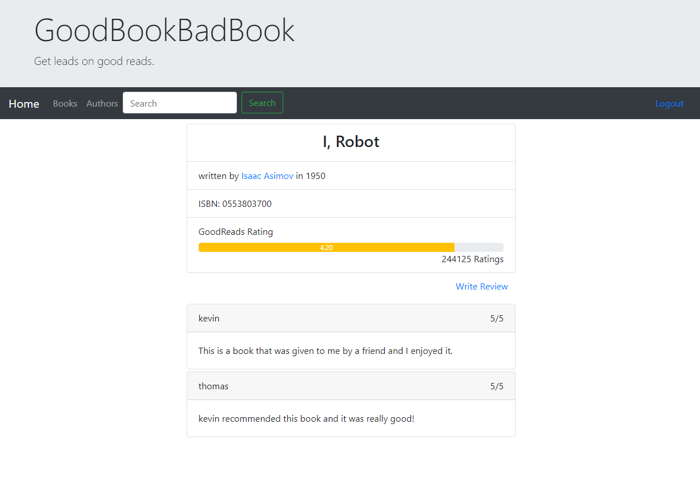
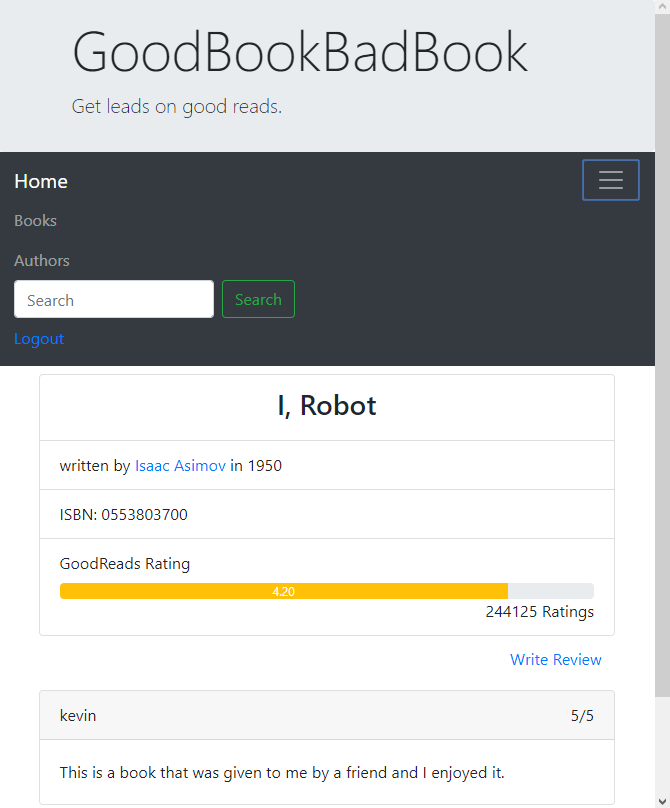

# GoodBookBadBook

Web Programming with Python and JavaScript

GoodBookBadBook is a fictional book review website where users can register/login/logout, 
browse through a list of books or authors, and search for books in the database.  

On each book's page, users can write reviews for their favorite books and see what other users 
are saying.  This page also uses the GoodReads API to display the GoodReads rating.

This site also implements its own API using the `api/<int:isbn>` route.

See it in action: https://youtu.be/PmtKz4WtRuA

Looks good on desktop:

Or on mobile!

To run from git bash:

`export FLASK_APP=application.py`

`export FLASK_DEBUG=1`   (optional)

`flask run`
